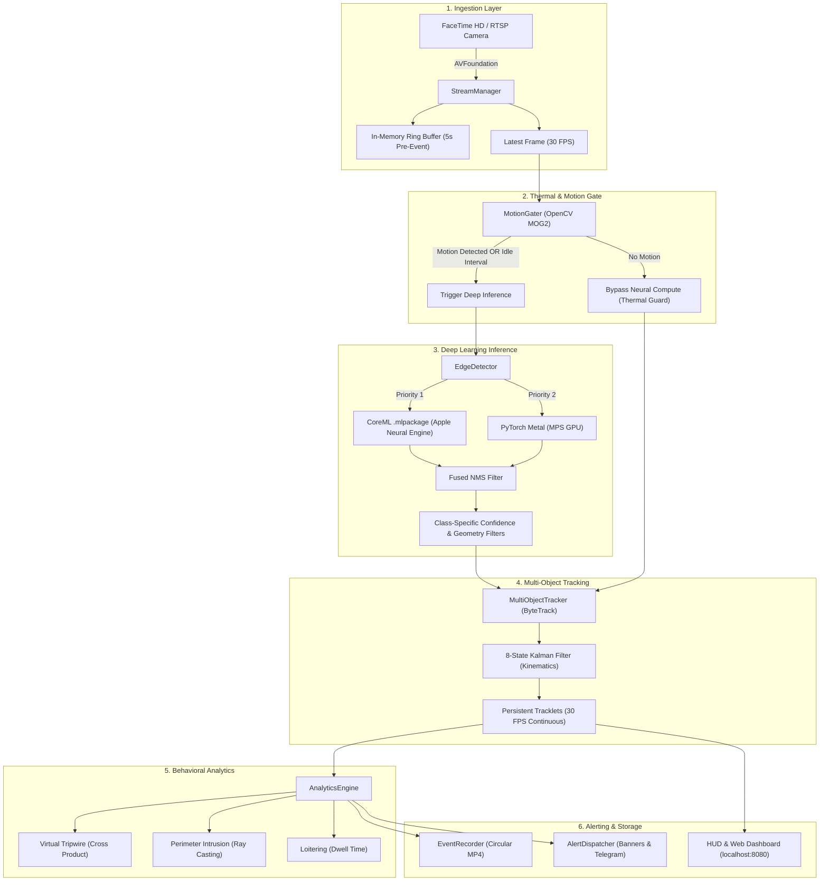

# Master Engineering Guide: Technologies, Architecture & Component Justifications
**Intelligent Video Surveillance & Behavioral Analytics (ISS)**
*Optimized for Apple Silicon macOS (Darwin arm64 / MacBook Air)*

---

## 1. Executive Overview & System Directive

The **Intelligent Surveillance System (ISS)** is an autonomous, on-device Edge AI video surveillance solution designed to run 24/7 on Apple Silicon hardware without requiring cloud GPUs, subscription APIs, or external servers.

### Architectural Philosophy
1. **Zero-Cloud Sovereignty**: All neural inferences, spatial analytics, video recording, and notification dispatching occur 100% locally on the host Mac. No video streams leave the local network.
2. **Thermal & Energy Sustainability**: Engineered specifically for fanless or compact Apple Silicon hardware (M1/M2/M3/M4). Employs two-stage motion gating, Apple Neural Engine (ANE) acceleration, and decoupled asynchronous threading to avoid thermal throttling.
3. **High-Precision Security Intelligence**: Balances high frame rates (30 FPS ingestion) with heavyweight neural recognition (YOLO11m) and kinematic trajectory tracking (Kalman-filtered ByteTrack).

---

## 2. Deep Learning & Computer Vision Models

### 2.1 YOLO11m (Medium Object Detector)
* **What it is**: The 2024 state-of-the-art vision architecture from Ultralytics, featuring ~20.1 million parameters, C3k2 building blocks, and spatial pyramid pooling fast (SPPF).
* **Why it was chosen over YOLO11n (Nano) & YOLO11s (Small)**:
  * **Precision Gap**: YOLO11m reaches **51.5 mAP** on COCO (+12.0 mAP over Nano's 39.5 mAP).
  * **Small Threat Detection**: Nano frequently fails to detect subtle handheld threat objects like knives (class 44), scissors (class 76), or cell phones (class 67). YOLO11m provides significantly denser feature maps that capture high-frequency details at distance.
  * **Occlusion Resistance**: When persons walk behind desks or obstacles, YOLO11m reliably detects partial bodies and heads where smaller models lose detection entirely.

### 2.2 Apple CoreML & Apple Neural Engine (ANE)
* **What it is**: Apple’s hardware-optimized machine learning inference framework and dedicated 16-core NPU.
* **Why it was chosen**:
  * **Zero CPU / Near-Zero GPU Load**: Running PyTorch continuously on GPU consumes 15–20W and heats up fanless MacBook Air chassis to >80°C within 15 minutes, triggering thermal throttling. CoreML compiles operations directly to the Apple Neural Engine, executing inferences at **under 5 Watts** and keeping the Mac cool (<45°C).
  * **Baked-in Non-Maximum Suppression (NMS)**: With `nms=True`, box decoding, score sorting, and suppression occur on hardware before transferring arrays back to Python, eliminating CPU-GPU memory copy latency.

### 2.3 PyTorch Metal Performance Shaders (MPS)
* **What it is**: PyTorch's native Apple Silicon backend leveraging the Metal framework for unified GPU compute.
* **Why it was chosen**:
  * Serves as the zero-dependency out-of-the-box accelerator for `.pt` weights without requiring prior CoreML compilation steps.
  * Integrated with a pre-flight warmup tensor (`dummy = torch.zeros(1, 3, 640, 640, device="mps")`) to compile Metal shaders once during boot, eliminating runtime stutter during actual security events.

### 2.4 OpenCV MOG2 Motion Gating
* **What it is**: Mixture of Gaussians (MOG2) adaptive background subtractor (`cv2.createBackgroundSubtractorMOG2`).
* **Why it was chosen**:
  * **Over 90% Compute Reduction**: In standard residential or office surveillance, scenes are stationary >90% of the time. Running a 20M parameter neural network on an empty room 30 times a second is wasteful.
  * MOG2 runs on downsampled grayscale frames in **under 0.8 ms** (<2% CPU). When no pixel changes exceed the threshold (`min_motion_area: 1200`), deep inference is skipped completely, preserving battery life and thermals.

---

## 3. Tracking & Kinematics Algorithms

### 3.1 8-State Constant-Velocity Kalman Filter
* **What it is**: An optimal recursive state estimator implemented in [core/tracker.py](file:///Users/jeet/Documents/MachineLearning/intelligent_surveillance/core/tracker.py).
* **State Vector**:
  $$\mathbf{x} = [c_x, c_y, w, h, v_x, v_y, v_w, v_h]^T$$
  where $(c_x, c_y)$ is the bounding box center, $(w, h)$ are dimensions, and $(v_x, v_y, v_w, v_h)$ are respective velocities.
* **Why it was chosen**:
  * **Continuous 30 FPS Interpolation**: Because YOLO11m inference runs asynchronously or on motion triggers, there are video frames where no new neural detection occurs. The Kalman prediction step ($\mathbf{x}_{k|k-1} = \mathbf{F} \mathbf{x}_{k-1}$) extrapolates target positions at the full 30 FPS camera rate.
  * **Velocity Vector Smoothing**: Eliminates jitter from raw neural bounding boxes, producing smooth trajectory trails.

### 3.2 Two-Stage ByteTrack Multi-Object Association
* **What it is**: An advanced association strategy that partitions detections into high-confidence ($conf \ge 0.40$) and low-confidence ($conf < 0.40$) groups.
* **Why it was chosen over simple Centroid/IoU tracking**:
  * **Occlusion & Blur Recovery**: When an intruder walks behind a pillar, doorframe, or moves quickly (motion blur), neural confidence temporarily plunges from 0.85 to 0.25. Standard trackers drop the object and spawn a brand-new track ID when it re-emerges.
  * ByteTrack’s **Stage 2** takes remaining unmatched tracks and matches them against low-confidence detections. This preserves the intruder’s identity (#1) and unbroken dwell time across occlusions.

---

## 4. Behavioral Analytics & Mathematics

### 4.1 Virtual Tripwire (Directional Line Crossing)
* **Mathematical Formulation**:
  Uses the 2D vector cross-product orientation test. Given tripwire line $\vec{L} = (P_1, P_2)$ and track movement from $P_{prev}$ to $P_{curr}$:
  $$\text{Orient}(A, B, C) = (B_x - A_x)(C_y - A_y) - (B_y - A_y)(C_x - A_x)$$
  A crossing occurs if and only if:
  $$\text{Orient}(P_1, P_2, P_{prev}) \times \text{Orient}(P_1, P_2, P_{curr}) < 0$$
  and directional vector dot product validates entry versus exit.
* **Why it was chosen**:
  * Sub-microsecond execution time ($O(1)$ scalar math).
  * Robust against camera jitter and frame skips; works regardless of crossing speed.

### 4.2 Perimeter Intrusion (Polygon Geo-Fencing)
* **Mathematical Formulation**:
  Ray-Casting Algorithm (Jordan Curve Theorem). Casts an imaginary horizontal ray from the object centroid $(x_0, y_0)$ to positive infinity ($x \to \infty$) and counts intersections with polygon edges:
  $$\text{Inside} \iff \sum \text{Intersections} \equiv 1 \pmod 2$$
* **Why it was chosen**:
  * Allows security operators to define complex non-rectangular security perimeters (e.g., parking lots, doorways, restricted server racks) with arbitrary vertices.

### 4.3 Loitering & Suspicious Dwell Detection
* **Mathematical Formulation**:
  Tracks cumulative residence time:
  $$T_{dwell} = t_{current} - t_{first\_seen}$$
  while checking that spatial displacement remains bounded within radius $R$:
  $$\|\mathbf{p}_t - \mathbf{p}_0\|_2 < R_{threshold}$$
* **Why it was chosen**:
  * Distinguishes transit pedestrians (passing through in 2–3 seconds) from suspicious loiterers (lingering around an entrance or ATM for >8 seconds).

---

## 5. Streaming, Concurrency & Hardware Video Codecs

### 5.1 OpenCV with macOS AVFoundation (`cv2.CAP_AVFOUNDATION`)
* **What it is**: Apple’s low-level media capture framework for macOS camera and video hardware.
* **Why it was chosen**:
  * Direct zero-copy hardware access to built-in FaceTime HD cameras and USB capture cards.
  * Avoids high-latency userspace V4L2/DirectShow translation layers and delivers hardware 30 FPS ingestion.

### 5.2 Circular In-Memory Ring Buffer (`collections.deque(maxlen=N)`)
* **What it is**: Thread-safe bounded double-ended queue storing raw video frames with timestamps.
* **Why it was chosen**:
  * **5-Second Pre-Event Footage**: Standard security recordings only capture what happens *after* an alert triggers. The ring buffer constantly stores the preceding 150 frames (5 seconds at 30 FPS). When an alert fires, the recorded MP4 file includes what led up to the intrusion.
  * Constant memory footprint (auto-discards oldest frames without re-allocating heap memory).

### 5.3 Decoupled Asynchronous Producer-Consumer Pipeline
* **What it is**: Multi-threaded architecture utilizing `threading.Thread`, `queue.Queue(maxsize=1)`, and atomic flags.
* **Why it was chosen**:
  * Traditional surveillance scripts run: `capture -> detect -> track -> render` in a single blocking `while True:` loop. If YOLO11m takes 35ms to infer, the camera loop drops from 30 FPS to 15 FPS, causing stutter.
  * ISS decouples acquisition: `StreamManager` pulls frames at hardware 30 FPS into queues; the detection worker processes the latest available frame; the rendering loop extrapolates tracks via Kalman filter without ever stalling.

---

## 6. Alerts, Recording & Communications

### 6.1 Native macOS Desktop Banners & Audio Alerts
* **What it is**: Scripting bridge dispatching via AppleScript (`osascript`) and macOS System Sound frameworks.
* **Why it was chosen**:
  * Native desktop banners integrate with macOS Notification Center without third-party daemon dependencies.
  * Plays native macOS audio tones (`Hero`, `Sosumi`, `Ping`) immediately upon perimeter breach.

### 6.2 Telegram Bot Integration (`requests`)
* **What it is**: Direct HTTPS REST dispatch to Telegram Bot API.
* **Why it was chosen**:
  * Delivers immediate push notifications with encoded JPEG photographic evidence directly to the operator's phone or mobile watch anywhere in the world.
  * Secure credential injection via environment variables (`ISS_TELEGRAM_BOT_TOKEN`, `ISS_TELEGRAM_CHAT_ID`) prevents hardcoded secret leaks.

### 6.3 Automated MP4 Incident Recording & Storage Pruning
* **What it is**: Bounded multi-incident video exporter with rolling retention rules.
* **Why it was chosen**:
  * Saves incidents into `.mp4` files using OpenCV VideoWriter.
  * Strict storage guards: Enforces `max_age_days: 14` and `max_total_mb: 2048`, automatically pruning the oldest clips to prevent filling the user's hard drive.

---

## 7. Web Dashboard & Telemetry

### 7.1 Built-in Lightweight HTTP & MJPEG Server
* **What it is**: Native Python `http.server.ThreadingHTTPServer` streaming MJPEG video and JSON telemetry on port 8080.
* **Why it was chosen**:
  * **Zero External Dependencies**: Requires no Node.js, npm, Nginx, or heavyweight web frameworks.
  * **Universal Compatibility**: Can be opened in any web browser (Safari, Chrome, iPhone/iPad browser on the local Wi-Fi) with real-time HUD video, FPS counters, and zone trigger statuses.

---

## 8. Configuration Architecture & Class Thresholding

### 8.1 Fail-Closed Schema Validation (`core/config_loader.py`)
* **What it is**: Strict recursive configuration validator in [core/config_loader.py](file:///Users/jeet/Documents/MachineLearning/intelligent_surveillance/core/config_loader.py).
* **Why it was chosen**:
  * A security system must never fail silently due to a typo in a YAML file.
  * `config_loader.py` enforces bounds checks (e.g., positive coordinates, valid models, existing paths, valid ports) and aborts startup with clear error messages if invalid.

### 8.2 Fine-Grained Class-Specific Confidence Mapping
* **Why it was chosen**:
  * In computer vision, a single global threshold (e.g. 0.45) is either too loose for common objects (causing false alarms on chairs/couches) or too strict for security threats (causing missed detections on small knives or distant phones).
  * ISS configures custom thresholds per COCO class ID:
    * `43 (knife): 0.22` — High recall for threat safety (COCO class 43).
    * `76 (scissors): 0.25` — High recall for threat safety.
    * `67 (cell phone): 0.38` — Balanced precision for asset tracking.
    * `63 (laptop): 0.40` — Balanced precision for asset tracking.
    * `0 (person): 0.55` — High precision to prevent false alarms from furniture/cushions.
    * General ambient objects: `0.50` — High precision to prevent visual clutter.

---

## 9. Comprehensive Repository File Inventory

| File Path | Functional Role | Key Dependencies | Why it Exists |
| :--- | :--- | :--- | :--- |
| [`main.py`](file:///Users/jeet/Documents/MachineLearning/intelligent_surveillance/main.py) | Master Pipeline Orchestrator | `cv2`, `time`, `threading` | Boots modules, manages async inference loop, renders HUD overlay, and handles shutdown. |
| [`config/settings.yaml`](file:///Users/jeet/Documents/MachineLearning/intelligent_surveillance/config/settings.yaml) | Declarative Configuration | YAML | Centralizes camera sources, model selection, class thresholds, analytics zones, and retention rules. |
| [`core/detector.py`](file:///Users/jeet/Documents/MachineLearning/intelligent_surveillance/core/detector.py) | Hardware Inference Engine | `ultralytics`, `torch`, `coremltools` | Loads YOLO11m / CoreML, executes Apple Silicon inference, and filters detections by class sensitivity. |
| [`core/tracker.py`](file:///Users/jeet/Documents/MachineLearning/intelligent_surveillance/core/tracker.py) | MOT & Kinematics Engine | `numpy`, `time` | Implements 8-state Kalman Filter and ByteTrack two-stage association for 30 FPS smooth tracking. |
| [`core/motion_gater.py`](file:///Users/jeet/Documents/MachineLearning/intelligent_surveillance/core/motion_gater.py) | Thermal Guard & Motion Gate | `cv2`, `numpy` | MOG2 background subtractor to bypass heavy neural inference when the scene is static. |
| [`core/analytics.py`](file:///Users/jeet/Documents/MachineLearning/intelligent_surveillance/core/analytics.py) | Behavioral Rules Engine | `numpy` | Computes geometric virtual tripwire line crossings, polygon perimeter breaches, and loitering times. |
| [`core/stream_manager.py`](file:///Users/jeet/Documents/MachineLearning/intelligent_surveillance/core/stream_manager.py) | Video Ingestion & Ring Buffer | `cv2`, `deque`, `threading` | Hardware AVFoundation camera capture thread with 5-second circular pre-event history buffer. |
| [`core/config_loader.py`](file:///Users/jeet/Documents/MachineLearning/intelligent_surveillance/core/config_loader.py) | Config Validation & Merging | `yaml`, `pathlib` | Enforces fail-closed schema validation on all user configurations before runtime execution. |
| [`core/web_stream.py`](file:///Users/jeet/Documents/MachineLearning/intelligent_surveillance/core/web_stream.py) | Web Dashboard & MJPEG Server | `http.server`, `json` | Provides browser dashboard on port 8080 with live video stream and real-time security telemetry. |
| [`alerts/dispatcher.py`](file:///Users/jeet/Documents/MachineLearning/intelligent_surveillance/alerts/dispatcher.py) | Notification Dispatcher | `osascript`, `requests` | Sends macOS desktop banners, plays system sounds, and forwards instant Telegram push notifications. |
| [`alerts/recorder.py`](file:///Users/jeet/Documents/MachineLearning/intelligent_surveillance/alerts/recorder.py) | Video Archival & Disk Guard | `cv2`, `threading` | Records MP4 incident clips combining pre-event ring buffer with live event frames, pruning old files. |
| [`scripts/benchmark_models.py`](file:///Users/jeet/Documents/MachineLearning/intelligent_surveillance/scripts/benchmark_models.py) | Hardware Profiler | `ultralytics`, `torch` | Profiles latency (ms), FPS, and memory usage across YOLO11n, YOLO11s, YOLO11m on Apple Silicon. |
| [`scripts/export_coreml.py`](file:///Users/jeet/Documents/MachineLearning/intelligent_surveillance/scripts/export_coreml.py) | CoreML Exporter | `ultralytics`, `coremltools` | One-command compilation of PyTorch weights to Apple CoreML `.mlpackage` with baked-in NMS for ANE. |
| [`tests/test_pipeline.py`](file:///Users/jeet/Documents/MachineLearning/intelligent_surveillance/tests/test_pipeline.py) | Full Integration Test Suite | `unittest`, `cv2` | Validates end-to-end pipeline, analytics geometry, mock detection, and video recording. |
| [`tests/test_tracker.py`](file:///Users/jeet/Documents/MachineLearning/intelligent_surveillance/tests/test_tracker.py) | Kinematics & MOT Unit Tests | `unittest`, `numpy` | Tests Kalman velocity extrapolation, ByteTrack low-confidence recovery, and class thresholds. |
| [`run.sh`](file:///Users/jeet/Documents/MachineLearning/intelligent_surveillance/run.sh) | Optimized Shell Launcher | Bash | Sets up venv, installs dependencies, verifies runtime environment, and boots the system. |
| [`requirements.txt`](file:///Users/jeet/Documents/MachineLearning/intelligent_surveillance/requirements.txt) | Dependency Specifications | pip | Pins optimized macOS wheels for PyTorch, OpenCV, PyYAML, and Ultralytics. |
